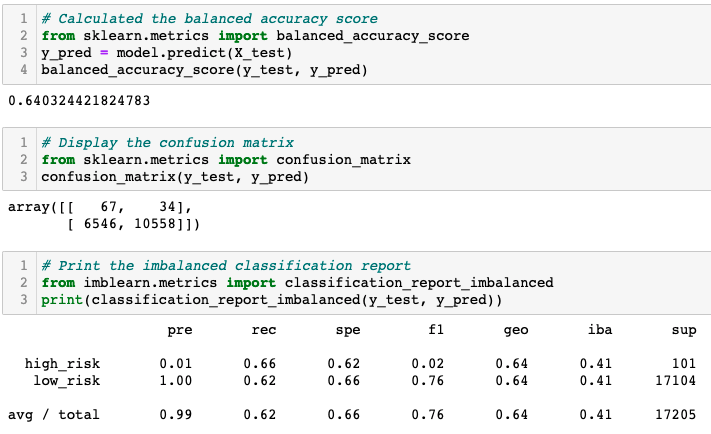
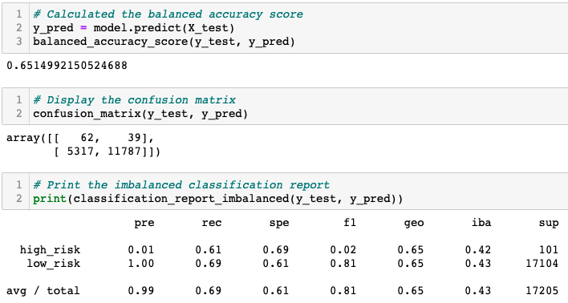
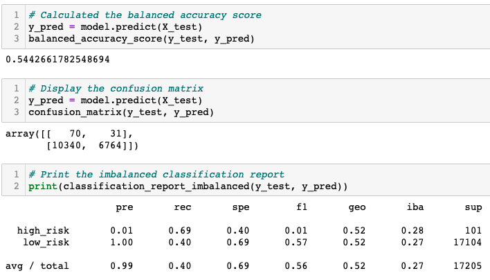
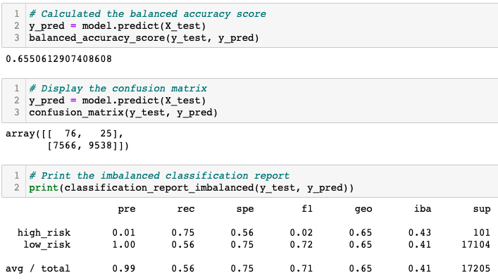
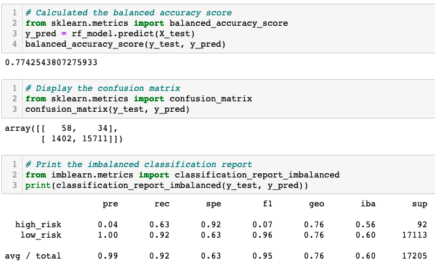
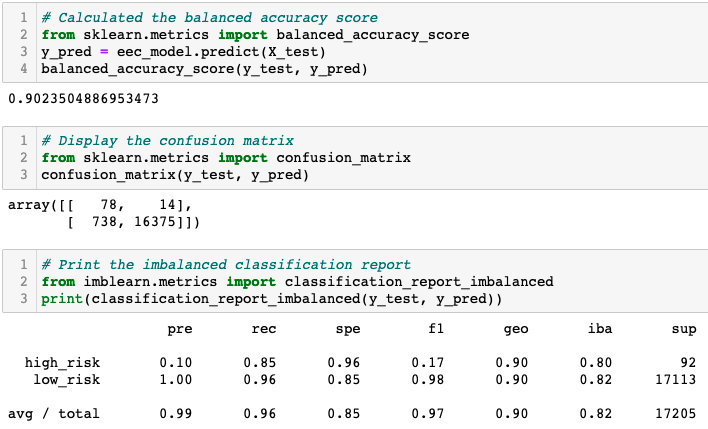

# Credit_Risk_Analysis

## Overview of the Analysis

The purpose of this analysis was to use six different machine learning models to access credit risk. The models that we used were RandomOverSampler, SMOTE, ClusterCentroids, SMOTEENN, BalancedRandomForestClassifier, and EasyEnsembleClassifier. We will then compare each of the models to see which one performed the best. We used the imbalanced-learn and scikit-learn libraries to accomplish this task.

## Results

- Naive Random Oversampling resulted in a balanced accuracy score of 64.03%. It had a precision of 1% for high risk users and 100% for low risk users. The recall was 66% for high risk and 62% for low risk. A screenshot of this analysis is shown below:

- SMOTE Oversampling resulted in a balanced accuracy score of 65.15%. It had a precision of 1% for high risk users and 100% for low risk users. The recall was 61% for high risk and 69% for low risk. A screenshot of this analysis is shown below:

- Cluster Centroid Undersampling had an accuracy score of 54.42%. It had a precision of 1% for high risk users and 100% for low risk users. Its recall was 69% for high risk and 40% for low risk. A screenshot of this analysis is shown below:

- SMOTEENN sampling had an accuracy score of 65.5%. It had a precision of 1% for high risk users and 100% for low risk users. Its recall was 75% for high risk and 56% for low risk.  A screenshot of this analysis is shown below:

- Balanced Random Forest had an accuracy score of 77.43%. It had a precision of 4% for high risk users and 100% for low risk users. Its recall was 63% for high risk and 92% for low risk. A screenshot of this analysis is shown below:

- Easy Ensemple Classifier had an accuracy score of 90.23%. It had a precision of 10% for high risk and 100% for low risk. Its recall was 85% for high risk and 96% for low risk. A screenshot of this analysis is shown below:

## Summary

The purpose of these models is to identify users that have the highest credit risk. So the model that we should suggest will be the model that has the highest recall of high risk users. Recall or sensitivity is calculated by taking the number of true positives and dividing it by the sum of true positives and false negatives. It is a measure of how many people who were are high risk were correctly identified. The models with the highest recall for high risk users from the six models are ranked as follows:

1. Easy Ensemble Classifier: 85%
2. SMOTEENN Sampling: 75%
3. Cluster Centroid Undersampling: 69%
4. Naive Random Oversampling: 66%
5. Balance Random Forest: 63%
6. SMOTE Oversampling: 61%

Another factor that we can look at to see the general effectiveness of our models is accuracy score. Accuracy score is the measure of the sum of all true positives and negatives divided by the sum of all true and false positives and true and false negatives. It tells us how often we can expect our model to correctly predict an outcome. Although accuracy score is less important than looking at the recall for high risk users, it is still a good indicator of the success of our models. Here are the rankings of each model based on accuracy score:

1. Easy Ensemble Classifier: 90.23%
2. Balance Random Forest: 77.43%
3. SMOTEENN Sampling: 65.5%
4. SMOTE Oversampling: 65.15%
5. Naive Random Oversampling: 64.03%
6. Cluster Centroid Undersampling: 54.42%

After comparing the recall of high risk users and the accuracy score for each of our models, it is clear the the best model to access credit score is Easy Ensemble Classifier as it came in first in both categories. 